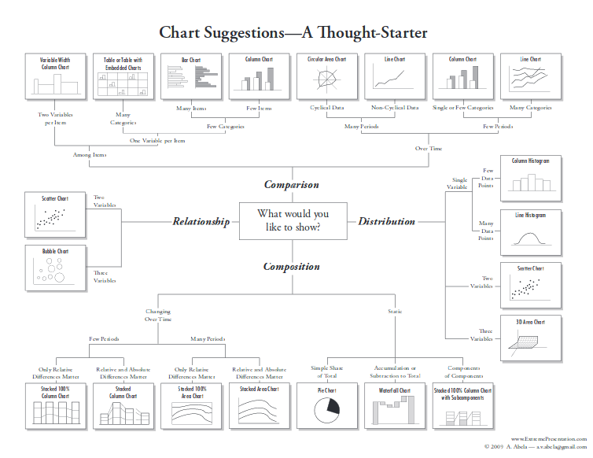

## Investigate a Dataset
Conduct data analysis and document findings, and brainstorm what questions you could answer using it. Then use Pandas and NumPy to answer these questions, and create a report sharing the answers

### Project Details

**Step One - Choose the Data Set**

<a href="https://www.gapminder.org/data/" target="_blank">Gapminder World</a> 
Gapminder has collected a lot of information about how people live their lives in different countries, tracked across the years, and on a number of different indicators

**Step Two - Get Organized**

<ins>Include:</ins>
- The report communicating the findings
- Any Python code written as part of your analysis
- The data set used

**Step Three - Analyze the Data**

- Suggest questions that promote looking at relationships between multiple variables. Analyze at least one dependent variable and three independent variables in your investigation
 
 
**Step Four - Share Findings**

- [Jupyter notebook](Investigate_a_Dataset.ipynb) - share findings alongside the code used to perform the analysis

- Submit report as an [HTML](Investigate_a_Dataset.html) file
 
 ### References
 
 <a href="https://buckwoody.wordpress.com/2015/12/30/the-hardest-thing-in-data-science/" target="_blank">The hardest thing in data science</a> 
 
 ***Chart Suggestions - A Thought-Starter*** 
 
 